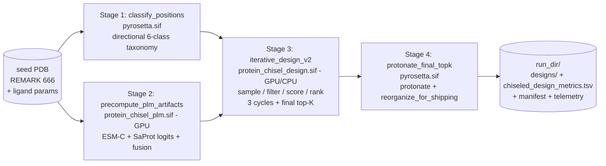

# protein_chisel

Iterative de-novo enzyme design pipeline driven by **ESM-C + SaProt PLM logit fusion** as a per-residue bias to **LigandMPNN**, with class-balanced AA bias, cross-cycle consensus reinforcement, **throat-blocker feedback**, and **multi-objective TOPSIS** ranking over a basket of structural / sequence / pocket metrics. Tuned for the **PTE (phosphotriesterase) PTE_i1** scaffold but the architecture is scaffold-agnostic — swap the seed PDB, ligand params, and (optionally) the catalytic motif spec via REMARK 666 / `--ptm` and the pipeline runs unchanged.

---

## Quickstart (cluster users)

```bash
# 1. Clone into your home directory
git clone git@github.com:SethWoodbury/protein_chisel.git ~/protein_chisel
cd ~/protein_chisel

# 2. Confirm read access to the cluster-shared resources (all read-only,
#    nothing here writes into anyone else's home).
ls -lh /net/software/containers/users/woodbuse/protein_chisel_plm.sif     # stage 2 (symlink -> esmc.sif)
ls -lh /net/software/containers/users/woodbuse/protein_chisel_design.sif  # stage 3 (symlink -> universal_with_tunnel_tools.sif)
ls -ld /net/software/containers/pyrosetta.sif                             # stages 1 + 4 (system)
ls -ld /net/software/lab/CAVER/caver_3.0.3                                # offline tunnel validation (optional)

# 3. Submit a run. INPUT_PDB and LIG_PARAMS are REQUIRED. (SEED_PDB
#    is also accepted as an alias for INPUT_PDB; OUTPUT_DIR is
#    accepted as an alias for WORK_ROOT below.)
INPUT_PDB=/path/to/your_seed.pdb \
LIG_PARAMS=/path/to/your_lig.params \
    sbatch scripts/run_chisel_design.sh

# 4. Multi-PDB sweep example: per-PDB output dir + minimal layout. Each
#    PDB lands in its own flat folder of {chiseled_design_metrics.tsv,
#    *_chisel_NNN.pdb}, easy to glob across.
for pdb in inputs/*.pdb; do
    stem=$(basename "$pdb" .pdb)
    INPUT_PDB="$pdb" \
    LIG_PARAMS=/path/to/lig.params \
    OUTPUT_DIR=/net/scratch/$USER/chisel_sweep/$stem \
    MINIMAL=1 \
        sbatch scripts/run_chisel_design.sh
done
```

The sbatch auto-detects its own checkout location — clone anywhere you have write access and it will work. All paths it reads (`/net/software/...`, `/net/databases/...`) are cluster-shared read-only resources usable by any account with cluster access; both `woodbuse` and `aruder2` are validated.

---

## What lands on disk

The driver writes a timestamped run dir under `$OUTPUT_DIR/chisel_design_<ts-pid>/` (`$OUTPUT_DIR` defaults to `/net/scratch/$USER`; `WORK_ROOT` is the legacy alias). After stage 4 (protonation + shipping reorganization) it ships in one of two layouts:

### Standard shipping layout (default)

```
run_dir/
├── designs/                       # PDBs (50, named <seed>_chisel_NNN.pdb)
├── chiseled_design_metrics.tsv    # 50 rows × ~150 metric cols
├── designs.fasta                  # sequences
├── cycle_metrics.tsv              # per-cycle dynamics
├── cycle_metrics.json             # same, JSON
├── manifest.json                  # full run config
├── protonation_summary.json
└── throat_blocker_telemetry.json  # per-cycle throat-feedback stats
```

Set `SAVE_INTERMEDIATES=1` to additionally keep the per-cycle subtrees (`cycle_00/`, `cycle_01/`, ...) for diagnostics.

### Minimal layout (`MINIMAL=1`)

```
run_dir/
├── designs/                          # PDBs (or flattened to run_dir/ — see below)
└── chiseled_design_metrics.tsv       # with first line = '# RUN_META: {...}'
```

The first line embeds the full run manifest + cycle metrics + throat telemetry as a single-line JSON comment, so a downstream notebook only needs the TSV to recover full provenance. Minimal mode saves inodes on `/net/scratch` for production sweeps.

When `MINIMAL=1` **and** `WORK_ROOT` was explicitly set by the caller (per-PDB sweep mode), the sbatch additionally consolidates everything one level up into `WORK_ROOT/`, so the final tree is exactly:

```
WORK_ROOT/<seed_stem>_chisel_NNN.pdb       # 50 flat PDBs
WORK_ROOT/chiseled_design_metrics.tsv      # 1 TSV with embedded RUN_META
```

Override the consolidation step with `CONSOLIDATE_TO_WORK_ROOT=0`.

---

## Reading outputs in JupyterHub

`scripts/load_chiseled_runs.py` glob-loads any number of runs into a single DataFrame, lifts the embedded RUN_META JSON into `_meta_*` columns, and adds a `run_id` provenance column:

```python
from protein_chisel.tools.load_chiseled_runs import load_runs
df = load_runs(
    "/net/scratch/woodbuse/chisel_sweep/*/chiseled_design_metrics.tsv"
)
df.shape  # (n_runs * 50, ~160)  -- 145 metrics + ~15 _meta_* cols + run_id
```

Or as a CLI:

```bash
python scripts/load_chiseled_runs.py \
    '/net/scratch/$USER/chisel_sweep/*/chiseled_design_metrics.tsv' \
    --out /tmp/all_runs.tsv
```

---

## Key environment variables / flags

| env var | default | role |
|---|---|---|
| `INPUT_PDB` (alias `SEED_PDB`) | **REQUIRED** | input backbone, with REMARK 666 catalytic motif lines |
| `LIG_PARAMS` | **REQUIRED** | Rosetta ligand .params file |
| `OUTPUT_DIR` (alias `WORK_ROOT`) | `/net/scratch/$USER` | top-level output dir; per-PDB sweeps should set this to a per-PDB subdir |
| `USE_GPU` | auto-detect | force GPU (`1`) or CPU (`0`) for stages 2 + 3; default probes `nvidia-smi` |
| `TARGET_K` | `50` | top-K size shipped at end of run |
| `N_CYCLES` | `3` | active-set design rounds |
| `MIN_HAMMING` | `3` | per-class diversity floor |
| `OMIT_AA` | `CX` | AAs MPNN never samples |
| `PTM` | `""` (empty) | PTM annotations, motif-index form. Example for PTE_i1 carbamylated catalytic Lys: `A/LYS/3:KCX` |
| `ESMC_MODEL` | `esmc_600m` | ESM-C variant for stage 2 PLM logits |
| `SAPROT_MODEL` | `saprot_1.3b` | SaProt variant for stage 2 PLM logits |
| `ENHANCE` | `""` | optional pLDDT-enhanced LigandMPNN checkpoint (empty = stock) |
| `MINIMAL` | unset | `1` triggers minimal shipping layout + (with explicit `WORK_ROOT`) per-PDB consolidation |
| `SAVE_INTERMEDIATES` | unset | `1` keeps `cycle_NN/` subtrees for diagnostics |
| `CONSOLIDATE_TO_WORK_ROOT` | `1` | flatten run_dir into WORK_ROOT when MINIMAL=1 + custom WORK_ROOT |
| `EXTRA_DRIVER_FLAGS` | `""` | passthrough to `iterative_design_v2.py` (e.g. `"--no_throat_feedback"`) |

The pipeline default `--throat_feedback ON` is set inside the driver; pass `EXTRA_DRIVER_FLAGS="--no_throat_feedback"` to disable for diagnostic runs (see "Throat-blocker feedback" below).

---

## Cluster resources

- **Apptainer / Singularity** must be on PATH (it is on `gpu-train` and `gpu-bf`).
- **GPU partition**: `gpu-bf` (default in the sbatch) or `gpu-train`. L40 / A100 / H100 all validated. Stage 2 (PLM) and stage 3 (driver) both use the GPU.
- **Walltime**: ~3:40–7:00 on a representative L=202 PTE_i1 job depending on PLM combo. Pre-throat-feedback rounds were ~6–8 min on gpu-train L40 and ~16–19 min in earlier sweeps.
- **Memory**: `--mem=20G` (whole-job; not per-cpu). Empirical peak 14.3 GB at L=210 with ESM-C 600m + SaProt 1.3b; bump to 24G for L>300. See [`docs/sweep_parameters.md`](docs/sweep_parameters.md) for the full memory model.
- **Scratch**: write access to `/net/scratch/$USER` for run output.
- **CPU partition**: viable but ~3.6× slower wall (~30 min for full 3-cycle); set `cpus=4` (the super-linear sweet spot) and drop `--nv`.

---

## Pipeline stages



1. **classify_positions** (`pyrosetta.sif`) — directional 6-class taxonomy: `primary_sphere / secondary_sphere / nearby_surface / distal_buried / distal_surface / ligand`, with sidechain-orientation gates (Tawfik / Markin preorganization framing).
2. **precompute_plm_artifacts** (`protein_chisel_plm.sif`, GPU) — runs ESM-C (default 600m) + SaProt (default 1.3b) on the seed sequence; computes log-odds, entropy-match, and the fused per-position bias matrix used by stage 3.
3. **iterative_design_v2** (`protein_chisel_design.sif`, GPU or CPU) — the main driver. Per cycle: sample LigandMPNN with the running bias, filter (charge/pI/clash/length), score (~145 metrics), rank by multi-objective TOPSIS, accumulate consensus + throat-blocker bias for the next cycle. After N_CYCLES, picks top-K with Hamming-diversity constraint.
4. **protonate_final_topk** (`pyrosetta.sif`) — protonates the top-K (PROPKA + PyRosetta, with PTM annotations preserved in REMARK 668), then `reorganize_for_shipping(minimal=...)` produces the standard or minimal output layout.

See [`docs/architecture.md`](docs/architecture.md) for the full per-cycle data flow, PLM fusion math, consensus + class-balance, TOPSIS internals, and the container split.

---

## Throat-blocker feedback (default ON)

After each cycle, top survivors are scored for pocket-entrance accessibility (homegrown ray-cast + pyKVFinder cavity detection). For each design the score includes a **breakdown** of `(resno, resname, mass_weight)` for designable bulky side chains in the throat band that block the best escape cone. These observations are aggregated, turned into a `(L, 20)` per-(position, AA) bias delta with exponential decay (default 0.5/cycle), and added to the LigandMPNN bias for cycle k+1 — actively pressuring MPNN to swap bulky residues at recurring throat positions.

**Cross-scaffold caveat**: throat feedback gives substantial gains on constricted scaffolds (validated on FS148 — pocket volume +17%, mean tunnel path +6%, sidechain-blocked −9%, with diversity actually *growing*) but is roughly neutral or slightly costly on scaffolds with already-open entrances (FS269, where there's no recurring blockage problem to fix). The "bias matters when there's a problem to fix, neutral when there isn't" intuition holds. Disable with `EXTRA_DRIVER_FLAGS="--no_throat_feedback"` for already-open scaffolds or when catalytic h-bond geometry is the primary objective.

Full mechanism, A/B sweep results, decay sensitivity, and cross-scaffold validation: [`docs/throat_blocker_feedback.md`](docs/throat_blocker_feedback.md).

---

## Apptainer images (three-sif suite)

The pipeline composes three apptainer/singularity containers via the shared filesystem (`run_chisel_design.sh` runs each stage in the appropriate sif and they exchange artifacts on disk — apptainer can only `exec` one image at a time, so multi-sif is the standard pattern in HPC bioinformatics):

| stage(s) | sif | source | GPU? | what's inside |
|---|---|---|---|---|
| 1, 4 | `/net/software/containers/pyrosetta.sif` | system | no | PyRosetta, PROPKA, BCL — for position classification + final protonation |
| 2 | `/net/software/containers/users/woodbuse/protein_chisel_plm.sif` | user (symlink → `esmc.sif`) | yes | Python 3.12, ESM 3.2.3 (ESM-C), SaProt, foldseek built-in, cu130 |
| 3 | `/net/software/containers/users/woodbuse/protein_chisel_design.sif` | user (symlink → `universal_with_tunnel_tools.sif`) | yes (or CPU) | Python 3.11, LigandMPNN, ESM 2.0.1, pyKVFinder, RDKit, MDAnalysis, prody, cu128 |

The user-suite sifs are aliased via symlink for friendly naming; the canonical filenames remain readable so any older path references keep working. The sbatch prefers the suite names and falls back to the legacy names.

**Why the design + plm sifs aren't merged into one big sif:** they're on incompatible Python/CUDA/ESM stacks — Python 3.11 vs 3.12, ESM 2.0.1 vs 3.2.3, cu128 vs cu130, plus different downstream ecosystem pinning. Trying to resolve them into one image would either downgrade ESM-C (regressing logits quality) or upgrade LigandMPNN's environment (breaking its tested pinning). Multi-sif is correct here.

**Optional override env vars** (set in the calling environment to point at custom-built sifs):
- `PLM_SIF=/path/to/your_plm.sif` — overrides stage 2.
- `TUNNEL_SIF=/path/to/your_design.sif` — overrides stage 3.

---

## Repo layout

```
protein_chisel/
├── scripts/
│   ├── iterative_design_v2.py          # main driver
│   ├── run_chisel_design.sh  # 4-stage / 3-sif slurm wrapper (PRODUCTION ENTRY)
│   ├── classify_positions_pte_i1.py    # stage 1 entrypoint
│   ├── precompute_plm_artifacts.py     # stage 2 entrypoint
│   ├── protonate_final_topk.py         # stage 4 entrypoint
│   ├── load_chiseled_runs.py           # JupyterHub loader for output TSVs
│   ├── run_caver.sh                    # offline CAVER tunnel validation
│   └── audit_*, *_ablation.py, ...     # diagnostic / one-off tools
├── src/protein_chisel/
│   ├── sampling/{plm_fusion, iterative_fusion, biased_mpnn, fitness_score}.py
│   ├── scoring/{multi_objective, dfi, preorganization, diversity, pareto}.py
│   ├── expression/{aa_class_balance, aa_composition, builtin_rules, engine, profiles}.py
│   ├── tools/{classify_positions, ligand_mpnn, tunnel_metrics, protonate_final,
│   │          ligand_geometry, fpocket_run, prolif_fingerprint, ...}.py
│   ├── filters/{protparam, protease_sites, length}.py
│   ├── structure/{clash_check, ss_provider, ...}.py
│   ├── io/{schemas, pdb, fasta}.py
│   └── utils/{apptainer, slurm, pose, geometry}.py
├── docs/                                # see table below
├── configs/, examples/, tests/
└── pyproject.toml
```

---

## Documentation

| File | What's inside |
|---|---|
| [`docs/architecture.md`](docs/architecture.md) | Pipeline diagram, per-cycle data flow, PLM fusion math, consensus + class-balance, TOPSIS, container split |
| [`docs/usage.md`](docs/usage.md) | sbatch + manual invocation, env knobs, common run patterns |
| [`docs/cli_reference.md`](docs/cli_reference.md) | All `iterative_design_v2.py` flags grouped by topic |
| [`docs/metrics_reference.md`](docs/metrics_reference.md) | Every column in `chiseled_design_metrics.tsv` with formula / units / range |
| [`docs/dependencies.md`](docs/dependencies.md) | SIFs, binaries, model checkpoints, HF caches, cluster paths |
| [`docs/troubleshooting.md`](docs/troubleshooting.md) | Known gotchas (libgfortran, freesasa fallback, AA-skew, position-1 M, consensus diversity) |
| [`docs/sweep_parameters.md`](docs/sweep_parameters.md) | 8 PTE_i1 design rounds + 6-way PLM-combo matrix + CPU scaling + memory model |
| [`docs/throat_blocker_feedback.md`](docs/throat_blocker_feedback.md) | Throat-blocker mechanism, A/B sweep, decay sensitivity, cross-scaffold validation |
| [`docs/tunnel_analysis.md`](docs/tunnel_analysis.md) | CAVER 3.0.3 offline validation wrapper + comparison to inline `tunnel_metrics` |
| [`docs/plans/`](docs/plans/) | Active design notes |

Legacy / overlapping references: [`docs/sampling.md`](docs/sampling.md), [`docs/scoring.md`](docs/scoring.md), [`docs/filters.md`](docs/filters.md), [`docs/tools.md`](docs/tools.md), [`docs/pipelines.md`](docs/pipelines.md), [`docs/io_and_schemas.md`](docs/io_and_schemas.md), [`docs/setup.md`](docs/setup.md), [`docs/testing.md`](docs/testing.md), [`docs/capabilities.md`](docs/capabilities.md), [`docs/future_plans.md`](docs/future_plans.md).

---

## Strengths

- **Avoids AF2/AF3/Boltz in the inner loop.** Fixed-backbone PyRosetta + cheap structural metrics + PLM marginals — AF3 only as an external filter on the top-K.
- **Calibrated PLM fusion.** Log-odds + entropy-match + position-class weights + cosine-disagreement shrinkage. Per-class strength tunable via `--plm_strength`.
- **Directional 6-class taxonomy.** Replaces flat SASA + distance bins.
- **Class-balanced AA bias** with extreme-over fallback (SWAPS over/under-rep AAs within a class instead of just suppressing the over-rep AA).
- **Consensus reinforcement** that's actually working. Cycle k+1 bias = base + `+strength` nats at agreed AAs in cycle-k survivors, capped at 30 % of L.
- **Throat-blocker feedback** (default ON) that targets recurring bulky pocket-entrance blockers.
- **Multi-objective TOPSIS** over ~14 default metrics; every weight + target overridable via `--rank_weights / --rank_targets`.
- **Annealing strategy** (`--strategy annealing`): light-filter relaxation in cycle 0, defaults by cycle 2; cycles 1+ use TOPSIS for survivor selection.
- **N/C-term padding** (`MSG`/`GSA`) so sequence-only metrics reflect the full expressed protein.
- **CPU pipeline validated end-to-end** at ~3.6× the GPU wall.
- **Full provenance.** Manifest + per-cycle bias / telemetry / class-balance JSONs + survivor TSVs at every stage; restartable.

## Weaknesses / scaffold-specific tuning notes

- **PTE_i1-tuned defaults baked in.** `DEFAULT_CATRES`, `CATALYTIC_HIS_RESNOS`, `CHAIN = "A"` are hard-coded in `scripts/iterative_design_v2.py`. Adapting to a new scaffold currently requires editing those constants (or running through `classify_positions` + a fork of the driver). A scaffold-agnostic CLI for these is planned but not done.
- **Charge band `[-18, -4]` and pI band `[5.0, 7.5]` are PTE-specific.** Override per scaffold via `--net_charge_max/--pi_min/--pi_max` when adapting.
- **Static PLM bias drift.** PLM marginals are computed once on the seed sequence; consensus + throat-feedback partly compensate but don't refresh the underlying PLM context.
- **Fixed backbone, no AF2/AF3 in the loop.** Foldability, induced fit, water networks, alternate ligand poses — not scored. Cheap filters are a *veto*, not a ranker.
- **fpocket dominates GPU runtime** (~37 % of cycle wall). Parallelization on the efficiency plan but not implemented.

---

## Citation / license

```
TBD — internal Baker Lab tool, license placeholder.

Citation:
    Woodbury et al., protein_chisel: PLM-fusion-driven iterative
    enzyme design with class-balanced AA bias, throat-blocker
    feedback, and multi-objective TOPSIS ranking. (Manuscript in
    preparation, 2026.)
```

Repository: `git@github.com:SethWoodbury/protein_chisel.git`
