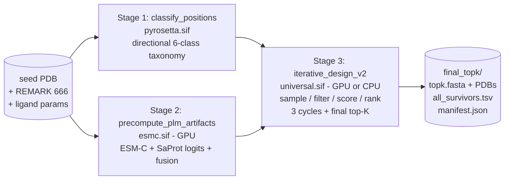

# protein_chisel

Iterative de-novo enzyme design pipeline driven by **ESM-C + SaProt PLM logit fusion** as a per-residue bias to **LigandMPNN**, with class-balanced AA bias, cross-cycle consensus reinforcement, and **multi-objective TOPSIS** ranking over a basket of structural / sequence / pocket metrics. Tuned for the **PTE (phosphotriesterase)** scaffold but the architecture is scaffold-agnostic — swap the seed PDB, ligand params, and catalytic resnos and the pipeline runs unchanged.

## Quickstart

```bash
# One-liner (defaults: 3 cycles × 500/400/300 samples, target_k=50, MSG/GSA termini, pH 7.8)
sbatch /home/woodbuse/codebase_projects/protein_chisel/scripts/run_iterative_design_v2.sbatch

# CPU partition (~3.6× slower than GPU but viable for high-throughput / low-priority sweeps)
sbatch -p cpu -c 8 --mem=24G --time=04:00:00 \
    scripts/run_iterative_design_v2.sbatch

# Manual invocation (after Stage 1 + 2 have produced classify/ and plm_artifacts/)
python scripts/iterative_design_v2.py \
    --seed_pdb $SEED_PDB \
    --ligand_params $LIG_PARAMS \
    --plm_artifacts_dir $WORK/plm_artifacts \
    --position_table $WORK/classify/positions.tsv \
    --target_k 50 --min_hamming 3 --cycles 3 \
    --strategy annealing \
    --plm_strength 1.25 \
    --n_term_pad MSG --c_term_pad GSA \
    --design_ph 7.8
```

Outputs land in `$WORK/iterative_design_v2_PTE_i1_<ts-pid>/{classify,plm_artifacts,cycle_00,cycle_01,cycle_02,final_topk,manifest.json}`. The shipped artifact is `final_topk/topk.fasta` + `final_topk/topk_pdbs/` + `final_topk/all_survivors.tsv`.

## Architecture (high-level)



See [`docs/architecture.md`](docs/architecture.md) for the full per-cycle data flow, consensus reinforcement, and TOPSIS internals.

## Documentation

| File | What's inside |
|---|---|
| [`docs/architecture.md`](docs/architecture.md) | Pipeline diagram, per-cycle data flow, PLM fusion math, consensus + class-balance, TOPSIS, container split |
| [`docs/usage.md`](docs/usage.md) | sbatch + manual invocation, env knobs, common run patterns |
| [`docs/cli_reference.md`](docs/cli_reference.md) | All `iterative_design_v2.py` flags grouped by topic |
| [`docs/metrics_reference.md`](docs/metrics_reference.md) | Every column in `all_survivors.tsv` with formula / units / range |
| [`docs/dependencies.md`](docs/dependencies.md) | SIFs, binaries, model checkpoints, HF caches, cluster paths |
| [`docs/troubleshooting.md`](docs/troubleshooting.md) | Known gotchas (libgfortran, freesasa fallback, AA-skew, position-1 M, consensus diversity) |
| [`docs/plans/`](docs/plans/) | Active design notes (directional taxonomy, efficiency, doc deployment) |

Legacy / overlapping references kept for now: [`docs/sampling.md`](docs/sampling.md), [`docs/scoring.md`](docs/scoring.md), [`docs/filters.md`](docs/filters.md), [`docs/tools.md`](docs/tools.md), [`docs/pipelines.md`](docs/pipelines.md), [`docs/io_and_schemas.md`](docs/io_and_schemas.md), [`docs/setup.md`](docs/setup.md), [`docs/testing.md`](docs/testing.md).

## Strengths

- **Avoids AF2/AF3/Boltz in the inner loop.** Fixed-backbone PyRosetta + cheap structural metrics + PLM marginals — AF3 only as a final external filter on the top-K.
- **Calibrated PLM fusion.** Log-odds + entropy-match + position-class weights + cosine-disagreement shrinkage. Per-class strength tunable via single `--plm_strength` knob.
- **Directional 6-class taxonomy.** `primary_sphere / secondary_sphere / nearby_surface / distal_buried / distal_surface / ligand` with sidechain-orientation gates (Tawfik / Markin preorganization framing). Replaces flat SASA + distance bins.
- **Class-balanced AA bias** with extreme-over fallback. SWAPS within an over/under-rep class (e.g. `E z=+5` paired with `D z=−2` → push E down + pull D up) instead of just suppressing the over-rep AA.
- **Consensus reinforcement** that's actually working. Cycle k+1 bias = base + `+strength` nats at agreed AAs in cycle-k survivors, capped at 30 % of L. Tunable via `--consensus_threshold/--consensus_strength/--consensus_max_fraction`.
- **Multi-objective TOPSIS** over 14 default metrics (fitness, druggability, lig-interaction strength, preorg strength, hbonds-to-cat, instability, sap_max, boman, aliphatic, gravy, charge, pi, bottleneck, pocket-hydrophobicity), every weight + target overridable via `--rank_weights / --rank_targets`.
- **Annealing strategy** (`--strategy annealing`): light-filter relaxation in cycle 0, defaults by cycle 2; cycles 1+ use TOPSIS for survivor selection. Hard filters (charge / pI / severe clash) stay constant across both strategies.
- **N/C-term padding** (`MSG`/`GSA` defaults). Sequence-only metrics (charge, pI, GRAVY, instability, aliphatic, boman) reflect the full expressed protein. Position-1 M is hard-omitted (start codon is in the vector tag).
- **Five charge variants @ pH 7.8.** `full_HH` is the filter; the others (`no_HIS`, `HIS_half`, `DE_KR_only`, Biopython) are diagnostic for sensitivity analysis.
- **DFI (GNM-based dynamic flexibility), aliphatic_index, boman_index** as cheap diagnostics on every survivor.
- **CPU pipeline validated end-to-end** at ~3.6× the GPU wall (8.2 min GPU → 9.8 min CPU per cycle on a representative PTE_i1 run). Viable for high-throughput / low-priority sweeps.
- **Full provenance.** Every run writes a `manifest.json` + per-cycle bias / telemetry / class-balance JSONs + survivor TSVs at every stage; restartable.

## Weaknesses / scaffold-specific tuning notes

- **PTE_i1-tuned defaults baked in.** `DEFAULT_CATRES = (60, 64, 128, 131, 132, 157)`, `CATALYTIC_HIS_RESNOS = (60, 64, 128, 132)`, `CHAIN = "A"` are hard-coded in `scripts/iterative_design_v2.py`. Adapting to a new scaffold currently requires editing those constants (or running through `classify_positions` + a fork of the driver). A scaffold-agnostic CLI for these is planned but not done.
- **Charge band `[-18, -4]` and pI band `[5.0, 7.5]` are PTE-specific.** WT PTE_i1 sits at net charge ≈ −12 / pI ≈ 4.6; bands picked to drift designs toward the pH 8 assay buffer without losing structural integrity. Override per scaffold via `--net_charge_max/--pi_min/--pi_max` when adapting.
- **Static PLM bias drift.** PLM marginals are computed once on the seed sequence; consensus reinforcement partly compensates but doesn't refresh the underlying PLM context. Refresh-on-survivors is a future improvement.
- **Fixed backbone, no AF2/AF3 in the loop.** Foldability, induced fit, water-mediated networks, alternate ligand poses — none of those are scored. The cheap filters are a **veto**, not a ranker; near-tied survivors should be treated as equivalent and triaged downstream by AF3.
- **fpocket dominates GPU runtime** (~37 % of cycle wall). Parallelization is on the efficiency plan but not implemented.
- **Position-table schema migration** is one-shot per run when the input is the legacy 5-class parquet. ~50 ms; benign but logged as a warning.
- **Catalytic K157 → forced KK dibasic at 157-158.** Pre-empted at sample time by `compute_catalytic_neighbor_omit_dict` (forbids K/R at 156/158); the WT itself trips the OmpT regex so we threshold at WT-count.

## Citation / license

```
TBD — internal Baker Lab tool, license placeholder.

Citation:
    Woodbury et al., protein_chisel: PLM-fusion-driven iterative
    enzyme design with class-balanced AA bias and multi-objective
    TOPSIS ranking. (Manuscript in preparation, 2026.)
```

Repository: `git@github.com:SethWoodbury/protein_chisel.git`
