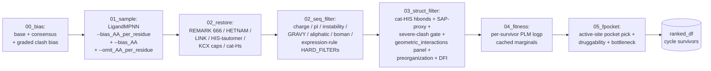
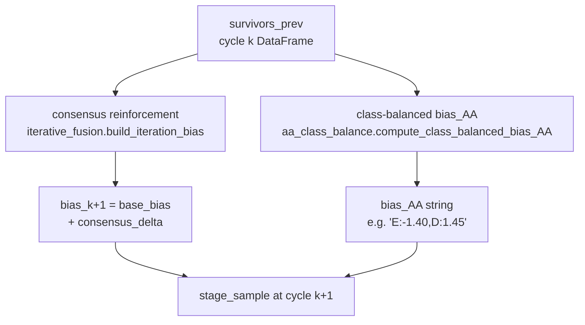
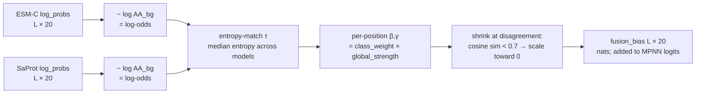

# Architecture

`protein_chisel`'s production pipeline is `scripts/iterative_design_v2.py` (the "v2 driver"), wrapped by `scripts/run_iterative_design_v2.sbatch`. It runs in three stages across three apptainer images, with file-based handoffs so each stage is independently restartable.

## Pipeline

```mermaid
flowchart TD
    seed[(seed PDB<br/>+ REMARK 666 catalytic motif<br/>+ ligand .params)]

    subgraph Stage1["Stage 1: classify_positions  (pyrosetta.sif, CPU)"]
        S1A[parse REMARK 666 → catalytic resnos]
        S1B[two-pass directional classifier:<br/>primary / secondary / nearby_surface /<br/>distal_buried / distal_surface / ligand]
        S1A --> S1B
    end

    subgraph Stage2["Stage 2: precompute_plm_artifacts  (protein_chisel_plm.sif, GPU)"]
        S2A[ESM-C masked-LM marginals  (L,20)]
        S2B[SaProt masked-LM marginals  (L,20)]
        S2C[calibrate → log-odds<br/>entropy-match across models<br/>cosine-disagreement shrinkage<br/>per-class β/γ weights]
        S2A --> S2C
        S2B --> S2C
    end

    subgraph Stage3["Stage 3: iterative_design_v2  (universal.sif, GPU or CPU)"]
        direction TB
        S3init[runtime PLM re-fusion +<br/>graded-clash bias +<br/>expression-rule omit_AA]
        S3init --> C0
        C0[cycle 0: bias = base PLM-fusion]
        C0 --> C1[cycle 1: bias = base + consensus_k0<br/>+ class-balanced bias_AA from k0 survivors]
        C1 --> C2[cycle 2: bias = base + consensus_k1<br/>+ class-balanced bias_AA from k1 survivors]
        C2 --> FINAL[final pool = ∪ cycle survivors,<br/>dedup, fpocket-druggability gate,<br/>multi-objective TOPSIS, diverse top-K]
    end

    seed --> Stage1
    seed --> Stage2
    Stage1 -- positions.tsv / parquet --> Stage3
    Stage2 -- esmc + saprot logits<br/>+ fusion artifacts --> Stage3
    Stage3 --> out[(final_topk/<br/>topk.fasta + topk_pdbs/<br/>all_survivors.tsv<br/>manifest.json)]
```

### Per-cycle sub-stages



### Container split

| SIF | Purpose | Stage | Hardware |
|---|---|---|---|
| `pyrosetta.sif` | PyRosetta (DSSP, SASA, classifier), parse REMARK 666 / cstfile, write canonical PositionTable | Stages 1 + 4 (final protonation) | CPU |
| `protein_chisel_plm.sif` (→ `esmc.sif`) | ESM-C 600M + SaProt 650M masked-LM marginals, py_contact_ms (CMS), PROPKA | Stage 2; optional `--cms_final` enrichment | GPU (16 GB VRAM, fp32) |
| `protein_chisel_design.sif` (→ `universal_with_tunnel_tools.sif`) | LigandMPNN, pyKVFinder, RDKit, MDAnalysis, prody, fpocket binary, freesasa, biopython, pandas, the protein_chisel package | Stage 3 (the iterative driver) | GPU preferred; CPU validated |

Bind-mount pattern: `--bind <REPO>:/code --env PYTHONPATH=/code/src` (where `<REPO>` is the auto-detected git checkout) lets every container import the package without a host-side `pip install`. See `scripts/run_iterative_design_v2.sbatch` for the canonical bind set.

## Per-cycle data flow

A single cycle takes the previous cycle's `survivors_prev` DataFrame (columns from the same per-cycle rank step) and feeds it into two independent priors that compose with the PLM bias:



**`survivors_prev` source choice (annealing only):** by default `survivors_prev` is the cycle's full ranked DataFrame (sorted by fitness). With `--strategy annealing`, cycles where `cyc.use_topsis_for_survivors=True` (cycles 1 and 2) instead score the cycle ranked frame with a per-cycle TOPSIS spec and feed the TOPSIS-sorted survivors forward — so each successive cycle's prior is shaped by full multi-objective performance, not just fitness alone.

### What `survivors_prev` carries

`survivors_prev` is the cycle's `ranked_df` from `stage_fpocket_rank` — i.e. a pandas DataFrame with one row per surviving design that passed the seq + struct filters, with columns:

- **identity / sequence**: `id`, `sequence`, `parent_design_id`
- **filter outcomes**: `passed_seq_filter`, `passed_struct_filter`, `fail_reasons`, `struct_fail`
- **sequence metrics**: `length`, `net_charge_full_HH`, `net_charge_no_HIS`, `net_charge_HIS_half`, `pi`, `instability_index`, `gravy`, `aliphatic_index`, `boman_index`, `aromaticity`, `flexibility_mean_seq`, `helix_frac_seq`, `sheet_frac_seq`, `turn_frac_seq`, `molecular_weight`, `extinction_280nm_*`
- **struct metrics**: `n_hbonds_to_cat_his`, `sap_max/sap_mean/sap_p95`, `clash__*`, `ligand_int__*` (geometric_interactions panel: hbonds / salt bridges / π-π / π-cation / hydrophobic, each with Gaussian strength), `preorg__*` (interactome around catalytic + first/second-shell), `dfi__*` (GNM dynamic flexibility per-class)
- **fitness**: `fitness__logp_fused_mean`, `fitness__logp_esmc`, `fitness__logp_saprot`
- **pocket**: `fpocket__druggability`, `fpocket__bottleneck_radius`, `fpocket__hydrophobicity_score`, `fpocket__mean_alpha_sphere_radius`, `fpocket__n_alpha_spheres_near_catalytic`
- **expression rules**: `n_expression_warnings`, `n_expression_soft_bias_hits`, `n_expression_hard_omit_hits`, `n_expression_hard_filter_hits`, `expression_rule_summary`

### Consensus reinforcement (cross-cycle)

`src/protein_chisel/sampling/iterative_fusion.py::build_iteration_bias` builds `bias_{k+1} = base_bias + consensus_delta` where:

- For each protein position whose class is in `{secondary_sphere, nearby_surface, distal_buried, distal_surface}` (legacy: `{first_shell, pocket, buried, surface}`) AND not in `fixed_resnos` (catalytic),
- empirical per-position AA frequency over `survivor_sequences` — if the top AA's frequency `≥ consensus_threshold` (default 0.85), add `+consensus_strength` nats (default 2.0) to that AA's bias entry.
- Cap: `max_augmented_fraction * L` positions augmented per cycle (default 0.30, ≈ 60 positions on PTE_i1 L=200). Top-agreement positions are kept when capped.
- All three knobs are CLI-tunable (`--consensus_threshold/--consensus_strength/--consensus_max_fraction`); telemetry is written to `cycle_NN/00_bias/telemetry.json` (n_eligible, n_augmented, augmented_resnos_1idx, capped).

This was silently broken before the 2026-05-04 rewrite (a class-name mismatch made `n_positions_eligible = 0`); restoring it cost ~50 % of pairwise Hamming diversity in a parameter sweep, motivating the diversity-tunable knobs.

### Class-balanced `bias_AA`

`src/protein_chisel/expression/aa_class_balance.py::compute_class_balanced_bias_AA` operates on the pooled `survivors_prev` sequences and emits a global `--bias_AA` string (`{aa: nats}` flat across all positions) added on top of the per-residue PLM bias.

The 8 AA classes:

| Class | Members |
|---|---|
| `hydrophobic_aliphatic` | A V L I M C |
| `aromatic` | F W Y H |
| `negatively_charged` | D E |
| `positively_charged` | K R H |
| `polar_uncharged` | S T N Q Y C H |
| `small` | A G S C T |
| `proline_special` | P (singleton) |
| `glycine_special` | G (singleton) |

Per multi-member class, find the highest-z and lowest-z members against `swissprot_ec3_hydrolases_2026_01`. If `z_high > balance_z_threshold` (default 2.0; CLI `--balance_z_threshold`) AND `z_low < −balance_z_threshold`, **swap**: down-weight `high_aa` by `min(max_bias_nats, bias_per_z·z_high)` and up-weight `low_aa` symmetrically.

**Extreme-over fallback.** If `z_high > over_z_threshold` (default 3.0) but no swap partner is under, downweight anyway (no up-weight). Added 2026-05-04 — without it, an AA at `z = +5` paired with the closest class member at `z = −1.7` would never get suppressed because the threshold required both ends extreme. Now extreme over-rep alone fires a one-sided correction.

Cycle 0 has no survivors → `bias_AA` is empty. Cycles 1+ get e.g. `"E:-1.40,D:+1.45,K:-0.80,R:+0.95"` flat across positions.

## PLM fusion (Stage 2 + runtime re-fusion)



Defaults from `FusionConfig` in `src/protein_chisel/sampling/plm_fusion.py`:

| Class | β = γ |
|---|---|
| `primary_sphere` | 0.05 |
| `secondary_sphere` | 0.20 |
| `nearby_surface` | 0.30 |
| `distal_buried` | 0.40 |
| `distal_surface` | 0.55 |
| `ligand` | 0.0 |

`global_strength = 1.0` (CLI `--plm_strength`, default 1.25 in the driver — empirical sweep on PTE_i1 found 1.2–1.3 the sweet spot for fitness recovery + druggability tightness + primary-shell diversity). The driver re-fuses at runtime so changes to `class_weights` take effect without re-running Stage 2; the runtime artifacts are snapshotted to `<run_dir>/fusion_runtime/{base_bias,weights_per_position,log_odds_*}.npy`.

A small **graded clash bias** (`compute_graded_clash_bias`) is added to the fusion bias before cycle 0: for each `(clash-prone position, bulky AA ∈ {Y,F,W,H,M,R})` pair, sample a 9-rotamer χ1×χ2 stub grid, count what fraction lands within 2.0 Å of any fixed-residue sidechain heavy atom, and subtract `20 · clash_fraction` nats from the corresponding bias entry. Replaces a previous all-or-nothing hard-omit that over-suppressed positions where the bulky AA actually fit.

## Multi-objective TOPSIS ranking

`src/protein_chisel/scoring/multi_objective.py` provides:

- `MetricSpec(column, direction ∈ {max, min, target}, weight, target=None, label)` — generalizes `Objective` by adding a `"target"` direction (deviation from a target value treated as a min-objective).
- `DEFAULT_METRIC_SPECS`: 14-axis basket tuned for PTE / hydrolase de-novo design.
- `compute_topsis_scores_v2(df, specs)` — TOPSIS over the spec basket: per-axis normalize to [0,1] (NaN → column mean), apply weights, compute distance to ideal vs. nadir, return `closeness = d_neg / (d_pos + d_neg)`.
- `apply_cli_overrides(specs, weights, targets)` — merge `--rank_weights k=v,k=v` and `--rank_targets k=v,k=v` onto the defaults; weight 0 drops a metric.
- `select_diverse_topk_two_axis(...)` — greedy top-K sorted by `mo_topsis` desc, gated by **both** full-sequence Hamming (`--min_hamming`, default 3) and primary-sphere Hamming (`--min_hamming_active`, default 0 = disabled).

### Default 14-metric basket

| Label | Column | Direction | Weight | Target |
|---|---|---|---|---|
| fitness | `fitness__logp_fused_mean` | max | 2.0 | — |
| druggability | `fpocket__druggability` | max | 1.0 | — |
| lig_int_strength | `ligand_int__strength_total` | max | 1.0 | — |
| preorg_strength | `preorg__strength_total` | max | 0.7 | — |
| hbonds_to_cat | `n_hbonds_to_cat_his` | max | 0.5 | — |
| instability | `instability_index` | min | 0.5 | — |
| sap_max | `sap_max` | min | 0.5 | — |
| boman | `boman_index` | target | 0.3 | 2.5 |
| aliphatic | `aliphatic_index` | target | 0.3 | 95.0 |
| gravy | `gravy` | target | 0.3 | −0.2 |
| charge | `net_charge_full_HH` | target | 0.3 | −10.0 |
| pi | `pi` | target | 0.3 | 5.5 |
| bottleneck | `fpocket__bottleneck_radius` | target | 0.3 | 3.65 |
| pocket_hydrophobicity | `fpocket__hydrophobicity_score` | target | 0.2 | 45.0 |

Final pool sort key: `(mo_topsis desc, fitness__logp_fused_mean desc)`. The legacy 2-key (fitness rank + alpha-radius rank) score is computed alongside as `legacy_rank_score` for back-compat / debugging.

## Strategies: constant vs. annealing

`--strategy {constant, annealing}` (default `constant`).

```mermaid
flowchart TD
    subgraph CONST[constant - legacy default]
        CC0[cycle 0:<br/>defaults x3<br/>survivors fed by fitness]
        CC1[cycle 1:<br/>defaults x3<br/>survivors fed by fitness]
        CC2[cycle 2:<br/>defaults x3<br/>survivors fed by fitness]
        CC0 --> CC1 --> CC2
    end

    subgraph ANN[annealing - explore→exploit]
        AC0[cycle 0 explore:<br/>light filters loose<br/>instability_max=80<br/>gravy [-1.0, +0.4]<br/>aliphatic_min=30<br/>boman_max=5.5<br/>TOPSIS fitness x3.0,<br/>others x0.1<br/>survivors fed by fitness]
        AC1[cycle 1 transition:<br/>light filters mid-loose<br/>instability_max=70<br/>gravy [-0.9, +0.35]<br/>aliphatic_min=35<br/>boman_max=5.0<br/>TOPSIS defaults<br/>survivors fed by TOPSIS]
        AC2[cycle 2 exploit:<br/>light filters at default<br/>instability_max=60<br/>gravy [-0.8, +0.3]<br/>aliphatic_min=40<br/>boman_max=4.5<br/>TOPSIS defaults<br/>survivors fed by TOPSIS]
        AC0 --> AC1 --> AC2
    end
```

**Hard filters never anneal.** Charge band (`[-18, -4]`), pI band (`[5.0, 7.5]`), severe-clash gate, fpocket-druggability gate, and the expression-rule `HARD_FILTER`s stay constant across all cycles in both strategies. Only the **light** filters (instability / GRAVY / aliphatic / boman) and **TOPSIS weights** anneal.

In annealing, cycles 1+ feed `survivors_prev` chosen by **multi-objective TOPSIS** (the `mo_topsis_cycle` column on the cycle's ranked frame), so the consensus prior reflects multi-objective good designs, not just high-fitness ones. This biases each successive cycle toward the full Pareto-front shape rather than the fitness ridge.

## Run layout

```
$WORK/iterative_design_v2_PTE_i1_<ts-pid>/
├── classify/
│   └── positions.tsv              # PositionTable from Stage 1
├── plm_artifacts/                 # from Stage 2 (cached, reused across runs)
│   ├── esmc_log_probs.npy         # (L, 20)
│   ├── saprot_log_probs.npy       # (L, 20)
│   ├── fusion_bias.npy            # (L, 20) — cached cycle-0 bias
│   ├── fusion_log_odds_{esmc,saprot}.npy
│   ├── fusion_weights.npy         # (L, 2)
│   └── manifest.json
├── fusion_runtime/                # runtime re-fusion snapshot (Stage 3)
│   ├── base_bias.npy
│   ├── weights_per_position.npy
│   ├── log_odds_{esmc,saprot}.npy
│   └── fusion_config.json
├── seed_tunnel_residues.tsv       # one-shot fpocket on the seed (channel-lining annotation)
├── cycle_00/
│   ├── 00_bias/{bias.npy, telemetry.json, class_balance_telemetry.json}
│   ├── 01_sample/{candidates.fasta, candidates.tsv, pdbs_restored/, omit_AA_per_residue.json}
│   ├── 02_seq_filter/{survivors_seq.tsv, rejects_seq.tsv}
│   ├── 03_struct_filter/{survivors_struct.tsv, rejects_struct.tsv, hbond_details.tsv}
│   ├── 04_fitness/scored.tsv
│   └── 05_fpocket/{ranked.tsv, per_design/}
├── cycle_01/                      # same layout
├── cycle_02/                      # same layout
├── final_topk/
│   ├── all_survivors.tsv          # full pool with mo_topsis + legacy_rank_score
│   ├── topk.tsv                   # diverse top-K
│   ├── topk.fasta
│   ├── topk_pdbs/                 # restored PDBs (REMARK 666 + tautomers + KCX)
│   ├── cms_final/topk_with_cms.tsv         # if --cms_final
│   └── rosetta_final/topk_with_rosetta.tsv # if --rosetta_final
└── manifest.json                  # full run config + output paths
```

## Provenance

`manifest.json` carries: `pipeline`, `seed_pdb`, `ligand_params`, `plm_artifacts_dir`, `position_table`, `fixed_resnos`, `catalytic_his_resnos`, `wt_length`, `target_k`, `diversity_min_hamming`, `n_cycles_run`, the full per-cycle `CycleConfig` dataclass dump, output paths, and `started_at = <ms-precision-ts>-pid<pid>`. The ms+PID timestamp prevents `run_dir` collisions across concurrent jobs (a real bug observed during a 4-job parallel sweep where second-precision timestamps overlapped).

Per-cycle telemetry JSONs (`telemetry.json`, `class_balance_telemetry.json`) record exactly which positions were augmented by consensus, which AA swaps fired in the class-balance step, and z-scores against the reference distribution — enough to replay any cycle's bias from disk.
