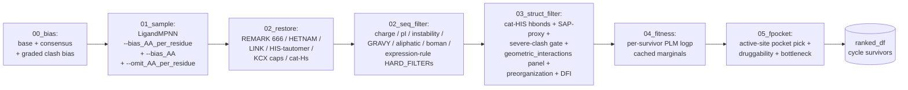
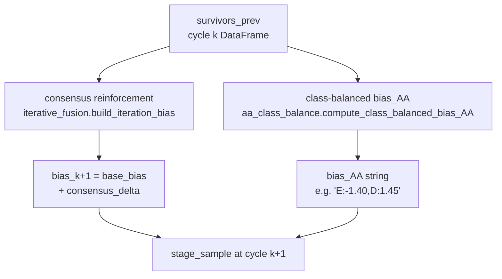
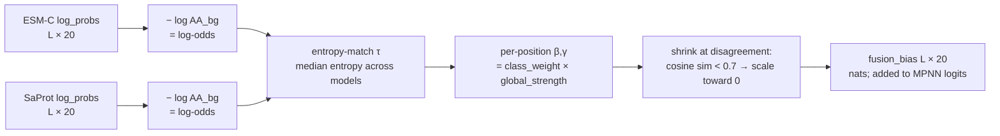

# Architecture

`protein_chisel`'s production pipeline is `scripts/iterative_design.py` (the "v2 driver"), wrapped by `scripts/run_chisel_design.sh`. It runs in three stages across three apptainer images, with file-based handoffs so each stage is independently restartable.

## Pipeline

```mermaid
flowchart TD
    seed[(seed PDB<br/>+ REMARK 666 catalytic motif<br/>+ ligand .params)]

    subgraph Stage1["Stage 1: classify_positions  (pyrosetta.sif, CPU)"]
        S1A[parse REMARK 666 → catalytic resnos]
        S1B[two-pass directional classifier:<br/>primary / secondary / nearby_surface /<br/>distal_buried / distal_surface / ligand]
        S1A --> S1B
    end

    subgraph Stage2["Stage 2: precompute_plm_artifacts  (protein_chisel_plm.sif, GPU)"]
        S2A[ESM-C masked-LM marginals  (L,20)]
        S2B[SaProt masked-LM marginals  (L,20)]
        S2C[calibrate → log-odds<br/>entropy-match across models<br/>cosine-disagreement shrinkage<br/>per-class β/γ weights]
        S2A --> S2C
        S2B --> S2C
    end

    subgraph Stage3["Stage 3: iterative_design  (universal.sif, GPU or CPU)"]
        direction TB
        S3init[runtime PLM re-fusion +<br/>graded-clash bias +<br/>expression-rule omit_AA]
        S3init --> C0
        C0[cycle 0: bias = base PLM-fusion]
        C0 --> C1[cycle 1: bias = base + consensus_k0<br/>+ class-balanced bias_AA from k0 survivors]
        C1 --> C2[cycle 2: bias = base + consensus_k1<br/>+ class-balanced bias_AA from k1 survivors]
        C2 --> FINAL[final pool = ∪ cycle survivors,<br/>dedup, fpocket-druggability gate,<br/>multi-objective TOPSIS, diverse top-K]
    end

    seed --> Stage1
    seed --> Stage2
    Stage1 -- positions.tsv / parquet --> Stage3
    Stage2 -- esmc + saprot logits<br/>+ fusion artifacts --> Stage3
    Stage3 --> out[(final_topk/<br/>topk.fasta + topk_pdbs/<br/>all_survivors.tsv<br/>manifest.json)]
```

### Per-cycle sub-stages


```mermaid
flowchart LR
    A[00_bias:<br/>base + consensus<br/>+ graded clash bias] --> B[01_sample:<br/>LigandMPNN<br/>--bias_AA_per_residue<br/>+ --bias_AA<br/>+ --omit_AA_per_residue]
    B --> C[02_restore:<br/>REMARK 666 / HETNAM /<br/>LINK / HIS-tautomer /<br/>KCX caps / cat-Hs]
    C --> D[02_seq_filter:<br/>charge / pI / instability /<br/>GRAVY / aliphatic / boman /<br/>expression-rule HARD_FILTERs]
    D --> E[03_struct_filter:<br/>cat-HIS hbonds + SAP-proxy +<br/>severe-clash gate +<br/>geometric_interactions panel +<br/>preorganization + DFI]
    E --> F[04_fitness:<br/>per-survivor PLM logp<br/>cached marginals]
    F --> G[05_fpocket:<br/>active-site pocket pick +<br/>druggability + bottleneck]
    G --> H[(ranked_df<br/>cycle survivors)]
```

### Container split

| SIF | Purpose | Stage | Hardware |
|---|---|---|---|
| `pyrosetta.sif` | PyRosetta (DSSP, SASA, classifier), parse REMARK 666 / cstfile, write canonical PositionTable | Stages 1 + 4 (final protonation) | CPU |
| `protein_chisel_plm.sif` (→ `esmc.sif`) | ESM-C 600M + SaProt 650M masked-LM marginals, py_contact_ms (CMS), PROPKA | Stage 2; optional `--cms_final` enrichment | GPU (16 GB VRAM, fp32) |
| `protein_chisel_design.sif` (→ `universal_with_tunnel_tools.sif`) | LigandMPNN, pyKVFinder, RDKit, MDAnalysis, prody, fpocket binary, freesasa, biopython, pandas, the protein_chisel package | Stage 3 (the iterative driver) | GPU preferred; CPU validated |

Bind-mount pattern: `--bind <REPO>:/code --env PYTHONPATH=/code/src` (where `<REPO>` is the auto-detected git checkout) lets every container import the package without a host-side `pip install`. See `scripts/run_chisel_design.sh` for the canonical bind set.

### Cross-enzyme generalizability

The pipeline was originally hard-wired to the PTE_i1 scaffold; four opt-in flags (defaults reproduce the PTE behavior) make it run on **any enzyme** (full descriptions in `docs/cli_reference.md` §13):

- **`--chain CHAIN_ID`** (env `CHAIN`, default `"A"`) — the catalytic/design chain id used by *every* structural read (H-bond / clash / preorganization / interaction detection, sequence extraction, secondary structure, tunnel lining). The chain was previously hard-coded to `"A"`; the env passthrough forwards the flag only when `CHAIN != "A"`, so the default is byte-identical.
- **`--catalytic_resnos R1,R2,…`** (env `CATALYTIC_RESNOS`) — fixed/protected catalytic residues, resolved **this flag > the seed's `REMARK 666` motif block > the hard-coded PTE_i1 builtin (`60,64,128,131,132,157`)**. Falling through to the builtin (no flag *and* no REMARK 666) emits a **loud warning** that the PTE residues are almost certainly wrong for a non-PTE scaffold — set the flag for any non-PTE seed without REMARK 666.
- **`--no_require_cat_his_hbond`** (env `REQUIRE_CAT_HIS=0`, default ON) — disables **only** the struct-filter criterion requiring ≥1 side-chain H-bond to a catalytic His, for enzymes whose mechanism has no catalytic His (otherwise that criterion rejects every design). SAP-proxy and clash criteria are unaffected.
- **`--aa_reference NAME`** (env `AA_REFERENCE`, default `swissprot_ec3_hydrolases_2026_01`) — the AA-composition baseline the over-representation checks (class-balanced `bias_AA` + the adaptive hydrophobic over-rep mask) score against. Select the design's own EC class for a non-hydrolase enzyme so z-scores compare to the right natural distribution; validated at parse time against `REFERENCE_DISTRIBUTIONS`.

## Per-cycle data flow

A single cycle takes the previous cycle's `survivors_prev` DataFrame (columns from the same per-cycle rank step) and feeds it into two independent priors that compose with the PLM bias:


```mermaid
flowchart TD
    SP[survivors_prev<br/>cycle k DataFrame]
    SP --> CB[class-balanced bias_AA<br/>aa_class_balance.compute_class_balanced_bias_AA]
    SP --> CR[consensus reinforcement<br/>iterative_fusion.build_iteration_bias]
    CB --> BAA[bias_AA string<br/>e.g. 'E:-1.40,D:1.45']
    CR --> BIAS[bias_k+1 = base_bias<br/>+ consensus_delta]
    BIAS --> SAMP
    BAA --> SAMP[stage_sample at cycle k+1]
```

**`survivors_prev` source choice (annealing only):** by default `survivors_prev` is the cycle's full ranked DataFrame (sorted by fitness). With `--strategy annealing`, cycles where `cyc.use_topsis_for_survivors=True` (cycles 1 and 2) instead score the cycle ranked frame with a per-cycle TOPSIS spec and feed the TOPSIS-sorted survivors forward — so each successive cycle's prior is shaped by full multi-objective performance, not just fitness alone.

### What `survivors_prev` carries

`survivors_prev` is the cycle's `ranked_df` from `stage_fpocket_rank` — i.e. a pandas DataFrame with one row per surviving design that passed the seq + struct filters, with columns:

- **identity / sequence**: `id`, `sequence`, `parent_design_id`
- **filter outcomes**: `passed_seq_filter`, `passed_struct_filter`, `fail_reasons`, `struct_fail`
- **sequence metrics**: `length`, `net_charge_full_HH`, `net_charge_no_HIS`, `net_charge_HIS_half`, `pi`, `instability_index`, `gravy`, `aliphatic_index`, `boman_index`, `aromaticity`, `flexibility_mean_seq`, `helix_frac_seq`, `sheet_frac_seq`, `turn_frac_seq`, `molecular_weight`, `extinction_280nm_*`
- **struct metrics**: `n_hbonds_to_cat_his`, `sap_max/sap_mean/sap_p95`, `clash__*`, `ligand_int__*` (geometric_interactions panel: hbonds / salt bridges / π-π / π-cation / hydrophobic, each with Gaussian strength), `preorg__*` (interactome around catalytic + first/second-shell), `dfi__*` (GNM dynamic flexibility per-class)
- **fitness**: `fitness__logp_fused_mean`, `fitness__logp_esmc`, `fitness__logp_saprot`
- **pocket**: `fpocket__druggability`, `fpocket__bottleneck_radius`, `fpocket__hydrophobicity_score`, `fpocket__mean_alpha_sphere_radius`, `fpocket__n_alpha_spheres_near_catalytic`
- **expression rules**: `n_expression_warnings`, `n_expression_soft_bias_hits`, `n_expression_hard_omit_hits`, `n_expression_hard_filter_hits`, `expression_rule_summary`

### Consensus reinforcement (cross-cycle)

`src/protein_chisel/sampling/iterative_fusion.py::build_iteration_bias` builds `bias_{k+1} = base_bias + consensus_delta` where:

- For each protein position whose class is in `{secondary_sphere, nearby_surface, distal_buried, distal_surface}` (legacy: `{first_shell, pocket, buried, surface}`) AND not in `fixed_resnos` (catalytic),
- empirical per-position AA frequency over `survivor_sequences` — if the top AA's frequency `≥ consensus_threshold`, add `+consensus_strength` nats to that AA's bias entry.
- Cap: `max_augmented_fraction * L` positions augmented per cycle (≈ 60 positions on PTE_i1 L=200 at the 0.30 `IterationConfig` default). Top-agreement positions are kept when capped.
- All three knobs are CLI-tunable (`--consensus_threshold/--consensus_strength/--consensus_max_fraction`). The `IterationConfig` dataclass defaults are `0.85 / 2.0 / 0.30`, but the **driver's argparse defaults override them to `0.90 / 1.0 / 0.15`** (the production schedule — see `docs/cli_reference.md` §4). Telemetry is written to `cycle_NN/00_bias/telemetry.json` (n_eligible, n_augmented, augmented_resnos_1idx, capped).

This was silently broken before the 2026-05-04 rewrite (a class-name mismatch made `n_positions_eligible = 0`); restoring it cost ~50 % of pairwise Hamming diversity in a parameter sweep, motivating the diversity-tunable knobs.

### Class-balanced `bias_AA`

`src/protein_chisel/expression/aa_class_balance.py::compute_class_balanced_bias_AA` operates on the pooled `survivors_prev` sequences and emits a global `--bias_AA` string (`{aa: nats}` flat across all positions) added on top of the per-residue PLM bias.

The 8 AA classes:

| Class | Members |
|---|---|
| `hydrophobic_aliphatic` | A V L I M C |
| `aromatic` | F W Y H |
| `negatively_charged` | D E |
| `positively_charged` | K R H |
| `polar_uncharged` | S T N Q Y C H |
| `small` | A G S C T |
| `proline_special` | P (singleton) |
| `glycine_special` | G (singleton) |

Per multi-member class, find the highest-z and lowest-z members against `swissprot_ec3_hydrolases_2026_01`. If `z_high > balance_z_threshold` (default 2.0; CLI `--balance_z_threshold`) AND `z_low < −balance_z_threshold`, **swap**: down-weight `high_aa` by `min(max_bias_nats, bias_per_z·z_high)` and up-weight `low_aa` symmetrically.

**Extreme-over fallback.** If `z_high > over_z_threshold` (default 3.0) but no swap partner is under, downweight anyway (no up-weight). Added 2026-05-04 — without it, an AA at `z = +5` paired with the closest class member at `z = −1.7` would never get suppressed because the threshold required both ends extreme. Now extreme over-rep alone fires a one-sided correction.

Cycle 0 has no survivors → `bias_AA` is empty. Cycles 1+ get e.g. `"E:-1.40,D:+1.45,K:-0.80,R:+0.95"` flat across positions.

## PLM fusion (Stage 2 + runtime re-fusion)


```mermaid
flowchart LR
    EC[ESM-C log_probs<br/>L × 20] --> CALI1[− log AA_bg<br/>= log-odds]
    SP[SaProt log_probs<br/>L × 20] --> CALI2[− log AA_bg<br/>= log-odds]
    CALI1 --> EM1[entropy-match τ<br/>median entropy across models]
    CALI2 --> EM1
    EM1 --> CW[per-position β,γ<br/>= class_weight × global_strength]
    CW --> SH[shrink at disagreement:<br/>cosine sim < 0.7 → scale toward 0]
    SH --> BIAS[fusion_bias  L × 20<br/>nats; added to MPNN logits]
```

Defaults from `FusionConfig` in `src/protein_chisel/sampling/plm_fusion.py`:

| Class | β = γ |
|---|---|
| `primary_sphere` | 0.05 |
| `secondary_sphere` | 0.20 |
| `nearby_surface` | 0.30 |
| `distal_buried` | 0.40 |
| `distal_surface` | 0.55 |
| `ligand` | 0.0 |

`global_strength = 1.0` (CLI `--plm_strength`, default 1.25 in the driver — empirical sweep on PTE_i1 found 1.2–1.3 the sweet spot for fitness recovery + druggability tightness + primary-shell diversity). The driver re-fuses at runtime so changes to `class_weights` take effect without re-running Stage 2; the runtime artifacts are snapshotted to `<run_dir>/fusion_runtime/{base_bias,weights_per_position,log_odds_*}.npy`.

A small **graded clash bias** (`compute_graded_clash_bias`) is added to the fusion bias before cycle 0: for each `(clash-prone position, bulky AA ∈ {Y,F,W,H,M,R,K})` pair, sample a 9-rotamer χ1×χ2 stub grid, count what fraction lands within 2.0 Å of any fixed-residue sidechain heavy atom, and subtract `20 · clash_fraction` nats from the corresponding bias entry. Replaces a previous all-or-nothing hard-omit that over-suppressed positions where the bulky AA actually fit. (Lys is included alongside Arg — both reach ~5.5–6 Å, so they're treated symmetrically.)

## Adaptive-controller framework & odds-space bias scaling

All steering — PLM fusion, consensus reinforcement, class balance, the adaptive
solubility controller, the composition levers — composes as **additive logit bias**
that MPNN folds into its per-position softmax. The design synthesis is
`docs/plans/controller_framework.md`; the shipped closed-loop controller is documented
in `docs/adaptive_bias.md`. This section records the principle that governs how all of
these knobs *scale*, the **damped control law** that became the default in 1.2.0, and the
**independent math review** that validated the additive-log-odds combination and fixed
the controller's scope.

The **actuating** controller set is deliberately small and orthogonal —
**{charge, surface (GRAVY), composition, throat}** — and is *not* expanded by the
redundant solubility objectives (see *Independent math review* below). Each axis is a
declarative `ControlAxis` (metric → target/band → per-AA actuator) in
`src/protein_chisel/sampling/adaptive_bias.py`; only `charge` + `surface_hydrophobicity`
are active by default, and the controller runs only under the opt-in `--adaptive_bias`.

### The odds-space scaling principle (why CF-1 exists)

MPNN samples each position from `softmax((logits + bias) / T)`, where `T` is the
per-cycle sampling temperature (the annealing schedule lowers it toward ~0.15). Adding
`bias` nats to a cell therefore multiplies that AA's **odds** by `exp(bias / T)`, not by
a fixed factor:

```
odds_shift = exp(bias / T)        # nats_for_odds(M, T) = T · ln(M)
```

The temperature is in the *denominator*, so a clamp expressed in **fixed nats silently
tracks the schedule**: the adaptive controller's default `max_nats = 0.6` is only
`exp(0.6/0.15) ≈ 55×` at `T = 0.15` but a much weaker shift at higher `T`, while the
PLM-fusion peak (~1.36 nats) is `exp(1.36/0.15) ≈ 8700×` and the additive stack
(PLM + consensus + clash + …) **multiplies in odds space** to ~10¹³× — locking cells and
collapsing diversity. A nats-space budget is thus not a stable notion of "authority".

The fix is to express clamps in **odds space**: `--adaptive_bias_max_odds X` (CF-1) sets
`max_nats := T · ln(X)` *each cycle*, so the controller's odds authority is `X`-fold
regardless of where the annealing schedule has `T` (helpers `nats_for_odds` /
`odds_for_nats` live in `src/protein_chisel/sampling/bias_scale.py`). The same arithmetic
explains the `--composition_soft_bias_nats` help text (a 0.5-nat penalty is ~12–28× at
`T ≈ 0.15–0.20`) and motivates the `--bias_total_clamp` / `--bias_total_clamp_odds`
(CF-3a) overflow guard on the **combined** effective bias (`--bias_total_clamp_odds X`
clamps the whole stack at `T · ln(X)` per cycle, the same temperature-invariant principle
applied to the sum rather than the controller's contribution alone).
`--controller_verbose` (CF-5) logs each axis's `effective_odds = exp(u/T)` to
`controller_trace.tsv` so this can be validated cycle-by-cycle.

### Damped control law (ON by default as of 1.2.0)

The controller's base law is a **gated leaky-integral PID with an online secant gain**
(`step_axis`, treated as sound and left untouched — see the review below). In closed-loop
testing on the cluster, that base law **under-damped against a *drifting* plant**: the
survivor-pool mean is not a static target but drifts cycle-to-cycle as the bias and the
upstream PLM/consensus interact, and the legacy law under-corrected, relaxed its integral
the moment the pool was momentarily in-band, then ramped hard when the pool drifted back.
A live trace **limit-cycled net charge −6.8 → −8.8 → −1.3** (a 49× drive ramp). As of
**1.2.0 the damping is ON by default** (`--no_controller_damping` / `CONTROLLER_DAMPING=0`
reverts to the legacy under-damped law); it bundles four classical stabilizers in one
switch:

- **EWMA of the measured pool mean** (`measurement_ewma_alpha = 0.5`) — react to the
  filtered trend, not per-cycle sampling noise.
- **derivative-on-measurement** (`derivative_gain = 0.5 · gain`) — anticipate the drift
  and begin correcting *before* the hard ramp. Differentiating the measurement (not the
  setpoint) avoids a derivative kick when the target/band changes.
- **per-cycle slew limit** (`slew_limit_frac = 0.15` of `max_nats`) — bound how far the
  drive can move in a single cycle, so no full-range lurch.
- **soft 'ramp' deadband** — a continuous drive *through* target replacing the hard on/off
  deadband, which kills the stick-slip that produced the limit cycle.

The damped law **held charge stable at the −10 target across mid and hard seeds**
(regression: the per-cycle drive swing fell 0.434 → 0.090, ~4.8×, vs the legacy 49× ramp).
This is a **deliberate default-path change** — but it only affects runs that already pass
`--adaptive_bias`; the `AdaptiveBiasConfig` library defaults remain no-op so the controller
unit tests are byte-identical, and the legacy law is one flag away.

### Independent math review (codex + subagent)

Before shipping 1.2.0 the controller / MPNN-biasing math was put through an independent
review (codex + a subagent). Three findings shaped the release:

1. **The additive log-odds combination is sound.** Summing per-source biases in logit
   space and folding them into `softmax((logits + bias)/T)` is exactly a
   **product-of-experts** over the per-source likelihoods — equivalently **Bayesian
   log-evidence pooling**: each expert (PLM fusion, consensus, class balance, each
   controller axis) contributes additive log-evidence and the softmax renormalizes. So the
   *structure* of the combination needs no change.
2. **The two genuinely unsound parts, both now fixed.** (a) The **under-damped control
   law** against a drifting plant (fixed by the default-ON damping above). (b) The lack of
   a cap on **correlated, same-direction priors**: PLM fusion, consensus, and class-balance
   can all push the *same* residues the *same* way, and because they add in log space they
   **multiply in odds space** (the ~10¹³× lock) and over-bias far past any single source's
   intended authority. The fix is the **odds-space clamps** — per-controller
   (`--adaptive_bias_max_odds`) and on the combined stack (`--bias_total_clamp_odds`) — not
   a change to the additive form.
3. **Most "new" solubility objectives are redundant and must NOT become bias controllers.**
   The catalog reduces to the existing actuators: **pI ≡ net charge** (both move D/E/K/R),
   **SAP ≡ GRAVY-on-the-surface** (both move surface hydrophobics), **aliphatic ⊂ GRAVY**
   (A/V/L/I are a hydrophobicity subset), and **instability = a dipeptide metric** with no
   clean per-AA projection. Adding a pI controller or a SAP controller would **double-lock
   the shared residues** (two axes fighting over the same D/E/K/R or surface-hydrophobic
   AAs), which is precisely the correlated-prior failure mode of finding (2). They are
   therefore kept as **liberal band filters + low-weight TOPSIS targets** (catch extremes
   only), *not* actuating controllers. This is why the actuating set stays
   **{charge, surface, composition, throat}**. Full objective catalog and tiering:
   `docs/plans/controller_framework.md`.

### Seed triage (`--plm_autoskip_bad_input`)

The PLM fusion is **conditioned on the seed** structure/sequence, so on a pathologically
hydrophobic or over-represented input it *amplifies* the bad composition rather than
fixing it — and per the principle above, at `T = 0.15` a ~1.36-nat fusion peak is a
~8700× lock, effectively pinning the seed's residue choices. Seed triage detects such an
input up front (GRAVY / single-AA fraction / hydrophobic fraction over the
`--plm_autoskip_*` ceilings, defaults `0.4 / 0.16 / 0.50`) and, when `--plm_autoskip_bad_input`
is set, **forces `--plm_strength` to 0 for the whole run** so LigandMPNN regenerates from
structure + fixed residues instead of inheriting the seed's composition. Verified on a
`GRAVY = 1.34` seed: GRAVY → −0.5, Ala 27% → 0.5%. This is the seed-quality counterpart
to the (surface-only) adaptive controller, which can steer the surface but cannot make a
hydrophobic *fold* soluble. Implementation: `src/protein_chisel/sampling/seed_triage.py`.

## Multi-objective TOPSIS ranking

`src/protein_chisel/scoring/multi_objective.py` provides:

- `MetricSpec(column, direction ∈ {max, min, target}, weight, target=None, label)` — generalizes `Objective` by adding a `"target"` direction (deviation from a target value treated as a min-objective).
- `DEFAULT_METRIC_SPECS`: 14-axis basket tuned for PTE / hydrolase de-novo design.
- `compute_topsis_scores_v2(df, specs)` — TOPSIS over the spec basket: per-axis normalize to [0,1] (NaN → column mean), apply weights, compute distance to ideal vs. nadir, return `closeness = d_neg / (d_pos + d_neg)`.
- `apply_cli_overrides(specs, weights, targets)` — merge `--rank_weights k=v,k=v` and `--rank_targets k=v,k=v` onto the defaults; weight 0 drops a metric.
- `select_diverse_topk_two_axis(...)` — greedy top-K sorted by `mo_topsis` desc, gated by **both** full-sequence Hamming (`--min_hamming`, default 3) and primary-sphere Hamming (`--min_hamming_active`, default 0 = disabled).

### Default 14-metric basket

| Label | Column | Direction | Weight | Target |
|---|---|---|---|---|
| fitness | `fitness__logp_fused_mean` | max | 2.0 | — |
| druggability | `fpocket__druggability` | max | 1.0 | — |
| lig_int_strength | `ligand_int__strength_total` | max | 1.0 | — |
| preorg_strength | `preorg__strength_total` | max | 0.7 | — |
| hbonds_to_cat | `n_hbonds_to_cat_his` | max | 0.5 | — |
| instability | `instability_index` | min | 0.5 | — |
| sap_max | `sap_max` | min | 0.5 | — |
| boman | `boman_index` | target | 0.3 | 2.5 |
| aliphatic | `aliphatic_index` | target | 0.3 | 95.0 |
| gravy | `gravy` | target | 0.3 | −0.2 |
| charge | `net_charge_full_HH` | target | 0.3 | −10.0 |
| pi | `pi` | target | 0.3 | 5.5 |
| bottleneck | `fpocket__bottleneck_radius` | target | 0.3 | 3.65 |
| pocket_hydrophobicity | `fpocket__hydrophobicity_score` | target | 0.2 | 45.0 |

Final pool sort key: `(mo_topsis desc, fitness__logp_fused_mean desc)`. The legacy 2-key (fitness rank + alpha-radius rank) score is computed alongside as `legacy_rank_score` for back-compat / debugging.

## Strategies: constant vs. annealing

`--strategy {constant, annealing}` (default `constant`).

```mermaid
flowchart TD
    subgraph CONST[constant - legacy default]
        CC0[cycle 0:<br/>defaults x3<br/>survivors fed by fitness]
        CC1[cycle 1:<br/>defaults x3<br/>survivors fed by fitness]
        CC2[cycle 2:<br/>defaults x3<br/>survivors fed by fitness]
        CC0 --> CC1 --> CC2
    end

    subgraph ANN[annealing - explore→exploit]
        AC0[cycle 0 explore:<br/>light filters loose<br/>instability_max=80<br/>gravy [-1.0, +0.4]<br/>aliphatic_min=30<br/>boman_max=5.5<br/>TOPSIS fitness x3.0,<br/>others x0.1<br/>survivors fed by fitness]
        AC1[cycle 1 transition:<br/>light filters mid-loose<br/>instability_max=70<br/>gravy [-0.9, +0.35]<br/>aliphatic_min=35<br/>boman_max=5.0<br/>TOPSIS defaults<br/>survivors fed by TOPSIS]
        AC2[cycle 2 exploit:<br/>light filters at default<br/>instability_max=60<br/>gravy [-0.8, +0.3]<br/>aliphatic_min=40<br/>boman_max=4.5<br/>TOPSIS defaults<br/>survivors fed by TOPSIS]
        AC0 --> AC1 --> AC2
    end
```

**Hard filters never anneal.** Charge band (`[-18, -4]`), pI band (`[5.0, 7.5]`), severe-clash gate, fpocket-druggability gate, and the expression-rule `HARD_FILTER`s stay constant across all cycles in both strategies. Only the **light** filters (instability / GRAVY / aliphatic / boman) and **TOPSIS weights** anneal.

In annealing, cycles 1+ feed `survivors_prev` chosen by **multi-objective TOPSIS** (the `mo_topsis_cycle` column on the cycle's ranked frame), so the consensus prior reflects multi-objective good designs, not just high-fitness ones. This biases each successive cycle toward the full Pareto-front shape rather than the fitness ridge.

## Run layout

```
$WORK/iterative_design_v2_PTE_i1_<ts-pid>/
├── classify/
│   └── positions.tsv              # PositionTable from Stage 1
├── plm_artifacts/                 # from Stage 2 (cached, reused across runs)
│   ├── esmc_log_probs.npy         # (L, 20)
│   ├── saprot_log_probs.npy       # (L, 20)
│   ├── fusion_bias.npy            # (L, 20) — cached cycle-0 bias
│   ├── fusion_log_odds_{esmc,saprot}.npy
│   ├── fusion_weights.npy         # (L, 2)
│   └── manifest.json
├── fusion_runtime/                # runtime re-fusion snapshot (Stage 3)
│   ├── base_bias.npy
│   ├── weights_per_position.npy
│   ├── log_odds_{esmc,saprot}.npy
│   └── fusion_config.json
├── seed_tunnel_residues.tsv       # one-shot fpocket on the seed (channel-lining annotation)
├── cycle_00/
│   ├── 00_bias/{bias.npy, telemetry.json, class_balance_telemetry.json}
│   ├── 01_sample/{candidates.fasta, candidates.tsv, pdbs_restored/, omit_AA_per_residue.json}
│   ├── 02_seq_filter/{survivors_seq.tsv, rejects_seq.tsv}
│   ├── 03_struct_filter/{survivors_struct.tsv, rejects_struct.tsv, hbond_details.tsv}
│   ├── 04_fitness/scored.tsv
│   └── 05_fpocket/{ranked.tsv, per_design/}
├── cycle_01/                      # same layout
├── cycle_02/                      # same layout
├── final_topk/
│   ├── all_survivors.tsv          # full pool with mo_topsis + legacy_rank_score
│   ├── topk.tsv                   # diverse top-K
│   ├── topk.fasta
│   ├── topk_pdbs/                 # restored PDBs (REMARK 666 + tautomers + KCX)
│   ├── cms_final/topk_with_cms.tsv         # if --cms_final
│   └── rosetta_final/topk_with_rosetta.tsv # if --rosetta_final
└── manifest.json                  # full run config + output paths
```

## Provenance

`manifest.json` carries: `pipeline`, `seed_pdb`, `ligand_params`, `plm_artifacts_dir`, `position_table`, `fixed_resnos`, `catalytic_his_resnos`, `wt_length`, `target_k`, `diversity_min_hamming`, `n_cycles_run`, the full per-cycle `CycleConfig` dataclass dump, output paths, and `started_at = <ms-precision-ts>-pid<pid>`. The ms+PID timestamp prevents `run_dir` collisions across concurrent jobs (a real bug observed during a 4-job parallel sweep where second-precision timestamps overlapped).

Per-cycle telemetry JSONs (`telemetry.json`, `class_balance_telemetry.json`) record exactly which positions were augmented by consensus, which AA swaps fired in the class-balance step, and z-scores against the reference distribution — enough to replay any cycle's bias from disk.
